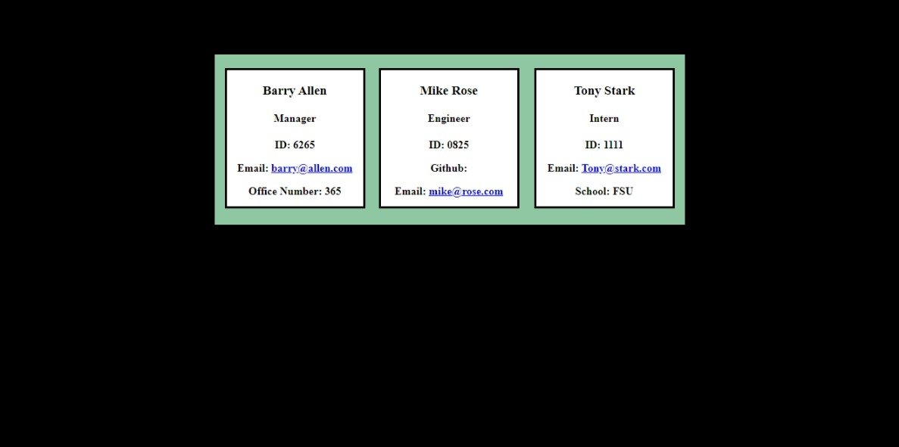

# Team Profile Generator

## Description
This generator was created to produce a team profile requiring a series of questions that an user answers in their command line using Node.js

# Table of Contents

 * [Installation](#installation)
 * [Usage](#usage)
 * [License](#license)
 * [Contributing](#contributing)
 * [Tests](#tests)
 * [Questions](#questions)
    

## Installation
User should clone the repository from GitHub and download Node. This application also requires a file system and inquirer module.

## License
Project is license under MIT

## Usage 

<a href="https://drive.google.com/file/d/1bwxTXjYR7Mu0EOfxnrRxLljV3au-eL2N/preview" width="640" height="480"></iframe>Link to Video</a>

## Contributing 

Under Installation section

## Tests

NPM Tests

## Questions

Reach me for additional questions at: mailto:mrose332@gmail.com.

To view deployed project at: https://github.com/Mrose332/readme-generator.git.
